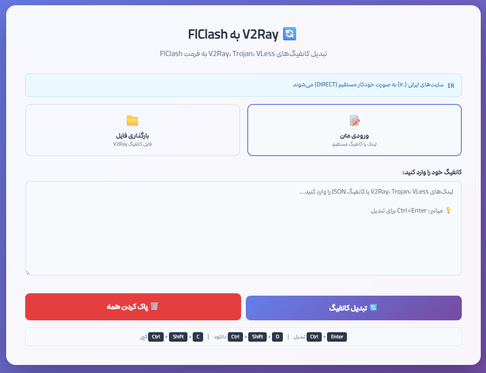

# V2Ray به FlClash Converter

تبدیل‌کننده آنلاین کانفیگ‌های V2Ray، Trojan و VLess به فرمت FlClash با قابلیت مسیریابی خودکار ترافیک ایران


---

## 📸 محیط برنامه

<div align="center">
  
</div>

---

## ✨ ویژگی‌ها

- **پشتیبانی از پروتکل‌ها**: VMess, VLess, Trojan
- **ورودی چندگانه**: لینک مستقیم، متن کانفیگ، یا بارگذاری فایل
- **خروجی استاندارد**: تولید فایل YAML سازگار با FlClash و Clash
- **مسیریابی خودکار**: سایت‌های ایرانی (.ir) به صورت خودکار مستقیم (DIRECT) می‌شوند
- **پیش‌نمایش**: مشاهده کانفیگ تولید شده قبل از دانلود
- **رابط کاربری فارسی**: طراحی کاملاً راست‌چین با پشتیبانی RTL
- **واکنش‌گرا**: سازگار با تمام اندازه صفحه‌نمایش

---

## 🚀 شروع سریع

### روش ۱: اجرای مستقیم
فایل `index.html` را در مرورگر باز کنید:

```bash
# ویندوز
start index.html

# مک
open index.html

# لینوکس
xdg-open index.html
```

### روش ۲: سرور محلی (اختیاری)
```bash
# استفاده از Python
python -m http.server 8000

# سپس مرورگر را باز کنید
# http://localhost:8000/index.html
```

---

## 📖 راهنمای استفاده

### ورودی‌ها

| نوع ورودی | فرمت | مثال |
|-----------|------|------|
| لینک VLess | `vless://...` | `vless://uuid@server:port?...` |
| لینک VMess | `vmess://...` (Base64) | `vmess://eyJhZGQiOi...` |
| لینک Trojan | `trojan://...` | `trojan://password@server:port?...` |
| JSON کانفیگ | V2Ray JSON config | `{"outbounds": [...]}` |
| فایل | `.json`, `.txt`, `.conf` | - |

### مراحل تبدیل

1. **انتخاب روش ورودی**: متن مستقیم یا بارگذاری فایل
2. **وارد کردن کانفیگ**: لینک‌ها یا متن کانفیگ را در کادر وارد کنید
3. **کلیک روی دکمه تبدیل**: کانفیگ‌ها پردازش می‌شوند
4. **دریافت خروجی**: دانلود YAML، کپی در کلیپ‌بورد، یا پیش‌نمایش

---

## 🏗️ معماری پروژه

```
HTML/
├── index.html   # فایل اصلی (SPA)
├── screenshot.png                 # اسکرین‌شات محیط برنامه
└── README.md                     # مستندات
```

### مؤلفه‌های اصلی

| مؤلفه | مسئولیت |
|-------|---------|
| `parseVlessLink()` | پارس لینک‌های VLess |
| `parseVmessLink()` | پارس لینک‌های VMess (Base64) |
| `parseTrojanLink()` | پارس لینک‌های Trojan |
| `parseConfigFile()` | پردازش JSON و لینک‌های مختلط |
| `convertOutboundToProxy()` | تبدیل outbounds V2Ray به فرمت Clash |
| `generateClashConfig()` | تولید کانفیگ نهایی YAML |

---

## ⚙️ کانفیگ خروجی

کانفیگ تولید شده شامل تنظیمات زیر است:

```yaml
# پورت‌ها
port: 7890              # HTTP Proxy
socks-port: 7891        # SOCKS5 Proxy
mixed-port: 7893        # Mixed Proxy (HTTP + SOCKS5)

# DNS
dns:
  enable: true
  enhanced-mode: fake-ip
  nameserver:
    - https://dns.google/dns-query
    - https://cloudflare-dns.com/dns-query

# قوانین مسیریابی
rules:
  - DOMAIN-SUFFIX,ir,DIRECT    # سایت‌های .ir مستقیم
  - GEOIP,IR,DIRECT            # IP‌های ایران مستقیم
  - MATCH,Auto-Fallback        # بقیه از پروکسی
```

---

## 🛠️ ساختار کانفیگ خروجی

### تنظیمات پیش‌فرض

| پارامتر | مقدار | توضیح |
|---------|-------|-------|
| `port` | 7890 | پورت HTTP |
| `socks-port` | 7891 | پورت SOCKS5 |
| `mixed-port` | 7893 | پورت ترکیبی |
| `allow-lan` | true | اتصال LAN |
| `mode` | rule | حالت قوانین |
| `log-level` | silent | بدون لاگ |

### DNS

- **Enhanced Mode**: `fake-ip` برای عملکرد بهتر
- **Nameserver**: Google DNS و Cloudflare DNS
- **Fake-IP Range**: `198.18.0.1/16`

### قوانین مسیریابی

1. **سایت‌های ایرانی**: `DOMAIN-SUFFIX,ir` → `DIRECT`
2. **IP‌های ایران**: `GEOIP,IR` → `DIRECT`
3. **بقیه ترافیک**: `MATCH` → `Auto-Fallback` (پروکسی خودکار)

---

## 🔧 پشتیبانی از پروتکل‌ها

### VMess
- UUID و AlterID
- رمزنگاری: auto, aes-128-gcm, chacha20-poly1305
- شبکه: tcp, ws, h2, grpc
- TLS اختیاری

### VLess
- UUID
- TLS با SNI
- شبکه: tcp, ws, h2, grpc
- Reality (جدید)

### Trojan
- رمز عبور
- TLS اجباری
- شبکه: tcp, ws

---

## 📱 سازگاری

| مرورگر | وضعیت |
|--------|-------|
| Chrome 90+ | ✅ پشتیبانی کامل |
| Firefox 88+ | ✅ پشتیبانی کامل |
| Safari 14+ | ✅ پشتیبانی کامل |
| Edge 90+ | ✅ پشتیبانی کامل |
| Opera 76+ | ✅ پشتیبانی کامل |

---

## 🎨 شخصی‌سازی

### تغییر پورت‌ها

در فایل HTML، مقادیر زیر را تغییر دهید:

```javascript
const config = {
    port: 7890,           // HTTP
    'socks-port': 7891,   // SOCKS5
    'mixed-port': 7893,   // Mixed
    // ...
};
```

### اضافه کردن قوانین مسیریابی

```javascript
rules: [
    'DOMAIN-SUFFIX,ir,DIRECT',
    'GEOIP,IR,DIRECT',
    'DOMAIN-SUFFIX,cn,Proxy',    // مثال: چین از پروکسی
    'MATCH,Auto-Fallback'
]
```

### تغییر DNS

```javascript
dns: {
    nameserver: [
        'https://dns.google/dns-query',
        'https://1.1.1.1/dns-query',
        'https://dns.quad9.net/dns-query'
    ]
}
```

---

## ❓ سؤالات متداول

### آیا این ابزار امن است؟
بله. تمام پردازش‌ها به صورت محلی در مرورگر انجام می‌شود و هیچ داده‌ای به سرور ارسال نمی‌شود.

### آیا می‌توانم کانفیگ‌های JSON V2Ray را وارد کنم؟
بله. فرمت JSON با ساختار `outbounds` پشتیبانی می‌شود.

### چرا برخی کانفیگ‌ها پردازش نمی‌شوند؟
ممکن است فرمت لینک استاندارد نباشد. مطمئن شوید لینک با `vless://`، `vmess://` یا `trojan://` شروع می‌شود.

### آیا می‌توانم خروجی را در Clash اندروید استفاده کنم؟
بله. فایل YAML تولید شده با Clash، Clash Meta، و FlClash سازگار است.

---

## 🤝 مشارکت

از مشارکت شما استقبال می‌شود!

1. Fork کنید
2. Branch جدید بسازید (`git checkout -b feature/amazing-feature`)
3. Commit دهید (`git commit -m 'Add amazing feature'`)
4. Push کنید (`git push origin feature/amazing-feature`)
5. Pull Request بزنید

---

## 📄 مجوز

این پروژه تحت مجوز MIT منتشر شده است.

```
MIT License

Copyright (c) 2024

Permission is hereby granted, free of charge, to any person obtaining a copy
of this software and associated documentation files (the "Software"), to deal
in the Software without restriction, including without limitation the rights
to use, copy, modify, merge, publish, distribute, sublicense, and/or sell
copies of the Software, and to permit persons to whom the Software is
furnished to do so, subject to the following conditions:

The above copyright notice and this permission notice shall be included in all
copies or substantial portions of the Software.

THE SOFTWARE IS PROVIDED "AS IS", WITHOUT WARRANTY OF ANY KIND, EXPRESS OR
IMPLIED, INCLUDING BUT NOT LIMITED TO THE WARRANTIES OF MERCHANTABILITY,
FITNESS FOR A PARTICULAR PURPOSE AND NONINFRINGEMENT. IN NO EVENT SHALL THE
AUTHORS OR COPYRIGHT HOLDERS BE LIABLE FOR ANY CLAIM, DAMAGES OR OTHER
LIABILITY, WHETHER IN AN ACTION OF CONTRACT, TORT OR OTHERWISE, ARISING FROM,
OUT OF OR IN CONNECTION WITH THE SOFTWARE OR THE USE OR OTHER DEALINGS IN THE
SOFTWARE.
```

---

## ⭐ حمایت

اگر این پروژه برایتان مفید بود، با یک ⭐ از ما حمایت کنید!

---

<div dir="rtl">

## 📞 ارتباط

- **Issues**: از بخش Issues گیت‌هاب استفاده کنید
- **Email**: [ایمیل خود را اضافه کنید]

---

**ساخته شده با ❤️ برای جامعه فارسی‌زبان**
</div>
